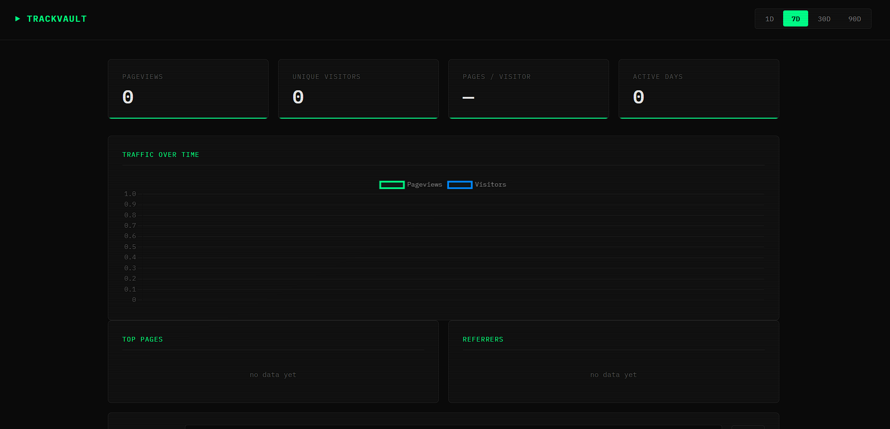

# Trackvault

**Self-hosted product analytics. One snippet. No third parties. No cookie banners.**

Own your analytics. No tracking scripts calling external APIs, no GDPR headaches, no vendor lock-in.

---

## Preview



---

## How it works

```
your website → lightweight event endpoint → SQLite → real-time dashboard
```

---

## Quick Start (2 min — Railway) As eg but you can use any

1. Fork this repo
2. Create a new project on [Railway](https://railway.app) and deploy from your fork
3. Add the snippet to your site:

```html
<script src="https://your-railway-url/track.js" async></script>
```

4. View your dashboard at `https://your-railway-url/dashboard.html`

---

## Full Deploy (VPS)

### 1. Get a VPS

- **Hetzner CX22** — €4/mo, fast, European servers
- **DigitalOcean Droplet** — $6/mo, easy UI

Get a server running Ubuntu 22+.

### 2. Install Docker

```bash
curl -fsSL https://get.docker.com | sh
```

### 3. Clone and start Trackvault

```bash
git clone https://github.com/yourusername/trackvault
cd trackvault
docker compose up -d
```

### 4. Point a domain at it

In your DNS provider, add an A record:

```
analytics.yoursite.com  →  YOUR_SERVER_IP
```

### 5. Set up HTTPS with nginx

```bash
apt install nginx certbot python3-certbot-nginx -y

cat > /etc/nginx/sites-available/trackvault << 'EOF'
server {
    server_name analytics.yoursite.com;
    location / {
        proxy_pass http://localhost:3000;
        proxy_set_header X-Forwarded-For $remote_addr;
    }
}
EOF

ln -s /etc/nginx/sites-available/trackvault /etc/nginx/sites-enabled/
nginx -t && systemctl reload nginx
certbot --nginx -d analytics.yoursite.com
```

### 6. Add snippet to your site

```html
<script src="https://analytics.yoursite.com/track.js" async></script>
```

### 7. Open dashboard

```
https://analytics.yoursite.com/dashboard.html
```

---

## Protect the dashboard

Set a token in `docker-compose.yml`:

```yaml
environment:
  - DASHBOARD_TOKEN=your-secret-token
```

Then restart:
```bash
docker compose up -d
```

Access at:
```
https://analytics.yoursite.com/dashboard.html?token=your-secret-token
```

> ⚠️ For production, consider placing Trackvault behind basic auth or a VPN instead of a URL token.

---

## Local testing

```bash
npm install
npm start
```

Open `http://localhost:3000/dashboard.html`. To send a test event without touching your site, paste this in your browser console:

```js
fetch('http://localhost:3000/event', {
  method: 'POST',
  headers: { 'Content-Type': 'application/json' },
  body: JSON.stringify({ path: '/test', referrer: '', ua: 'test', w: 1920, h: 1080, sid: 'abc123', ts: Date.now() })
})
```

---

## vs alternatives

| | Trackvault | Plausible | Umami | GA4 |
|---|---|---|---|---|
| Self-hosted | ✅ | ✅ | ✅ | ❌ |
| No cookies | ✅ | ✅ | ✅ | ❌ |
| No external requests | ✅ | ❌ | ❌ | ❌ |
| Setup time | ~5 min | ~15 min | ~15 min | ~20 min |
| Dependencies | Node + SQLite | Postgres | MySQL/Postgres | Google |
| Free | ✅ | $9/mo cloud | ✅ | ✅ |

---

## Configuration

| Variable | Default | Description |
|---|---|---|
| `PORT` | `3000` | Server port |
| `DB_PATH` | `./data/events.db` | SQLite file location |
| `DASHBOARD_TOKEN` | _(none)_ | If set, dashboard requires `?token=VALUE` |

---

## Privacy & compliance

No cookies, no cross-site tracking. Data stays on your server. You are fully in control of compliance.

---

## Backup

```bash
docker cp trackvault-pockettrack-1:/app/data/events.db ./backup.db
```

---

## License

Apache License 2.0
